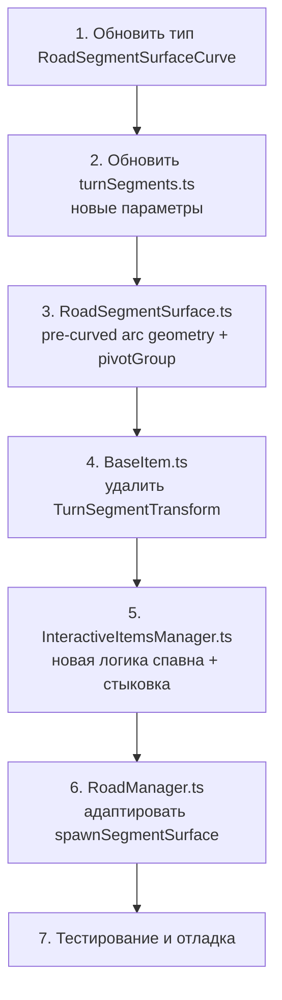

# План рефакторинга: дугообразные сегменты (Curved Segments)

## Проблема

Текущая реализация деформирует вершины дороги **по-разному для каждого ряда** внутри одного сегмента через `envelope = sin(t * PI)`. Это создаёт S-образный "змеиный" изгиб: центр сегмента изогнут сильнее, чем края. Визуально — не дуга, а "змея".

## Цель

Сегмент-дуга — это **жёсткое тело** с **предварительно изогнутой геометрией** (arc shape). Сегмент имеет **pivot** (центр окружности, частью которой является дуга). Сегмент одновременно:
1. Движется линейно по Z (к игроку)
2. Вращается вокруг pivot'а как единое целое

Угол поворота меняется от **максимального при спавне** до **0 при достижении игрока**.

Следующий сегмент (прямой) спавнится **пристыкованным** к концу дуги — наследует её позицию и поворот.

---

## 1. Изменения в `turnSegments.ts` — новые параметры кривой

### Текущие параметры (неправильные):
```typescript
curve: {
  direction: "left",
  angleDeg: 1,        // непонятный коэффициент
  offsetLanes: 0.9,   // боковой сдвиг
  rowStart: 1,
  rowEnd: 120,
}
```

### Новые параметры:
```typescript
curve: {
  direction: "left",
  totalAngleDeg: 30,     // полный угол дуги в градусах (насколько изогнут сегмент)
  rowStart: 1,
  rowEnd: 120,
}
```

**`totalAngleDeg`** — единственный параметр крутизны поворота. Радиус дуги вычисляется автоматически:
```
radius = segmentLength / totalAngleRad
```
где `segmentLength = rowCount * rowLength`.

---

## 2. Изменения в `RoadSegmentSurface.ts` — новая архитектура

### Текущая (порочная):
- `createCurvedSegmentMeshes()` — создаёт плоские прямоугольные меши
- `updateCurveMeshes()` — каждый кадр деформирует вершины с per-row `envelope`
- `transformCurvePoint()` — применяет разный угол к каждому ряду

### Новая архитектура:

#### 2.1. Предварительно изогнутая геометрия (pre-curved arc)

Метод `createCurvedSegmentMeshes()` создаёт геометрию, где вершины уже расположены по дуге окружности.

**Математика для левого поворота:**

```
Центр окружности (pivot):  (-radius, 0, 0)  // слева от дороги
Центральная линия дороги:  для t от 0 до totalAngleRad:
  cx = -radius + radius * cos(t)
  cz = -radius * sin(t)

Левая обочина (ближе к центру):
  lx = -radius + (radius - roadWidth/2) * cos(t)
  lz = -(radius - roadWidth/2) * sin(t)

Правая обочина (дальше от центра):
  rx = -radius + (radius + roadWidth/2) * cos(t)
  rz = -(radius + roadWidth/2) * sin(t)
```

**Для правого поворота (зеркально):**
```
Центр окружности (pivot):  (+radius, 0, 0)  // справа от дороги
Центральная линия дороги:  для t от 0 до totalAngleRad:
  cx = radius - radius * cos(t)
  cz = -radius * sin(t)
```

**Примечание:** `t = 0` — ближний к игроку конец сегмента, `t = totalAngleRad` — дальний конец.

#### 2.2. Rigid-body вращение вокруг pivot

Убираем `updateCurveMeshes()` и `transformCurvePoint()`.

Вместо этого используем **pivot-группу** в Three.js:

```typescript
// В конструкторе или createCurvedSegmentMeshes():
this.pivotGroup = new THREE.Group();
this.pivotGroup.position.set(pivotX, 0, 0);  // pivotOffset
this.group.add(this.pivotGroup);

// Все меши дороги добавляем в pivotGroup, а не в group
this.pivotGroup.add(mesh);

// В update():
if (this.curve) {
  const progress = this.getProgress();  // 0..1, от спавна до игрока
  const angle = this.curve.totalAngleRad * (1 - progress);
  this.pivotGroup.rotation.y = angleSign * angle;
}
```

**`getProgress()`** — вычисляет, насколько сегмент продвинулся от `rotateStartZ` к `rotateEndZ`:
```typescript
private getProgress(): number {
  const denominator = this.curve.rotateEndZ - this.curve.rotateStartZ;
  if (denominator <= 0) return 1;
  const value = (this.group.position.z - this.curve.rotateStartZ) / denominator;
  const x = THREE.MathUtils.clamp(value, 0, 1);
  return x * x * (3 - 2 * x);  // smoothstep
}
```

#### 2.3. Обновление `RoadSegmentSurfaceCurve`

```typescript
export type RoadSegmentSurfaceCurve = {
  direction: "left" | "right";
  totalAngleRad: number;     // полный угол дуги в радианах
  rowStart: number;
  rowEnd: number;
  rotateStartZ: number;
  rotateEndZ: number;
  // radius вычисляется из totalAngleRad и длины сегмента
};
```

#### 2.4. Side objects на дуге

`addCurvedSideObjects()` и `addCurveSideObject()` — объекты просто добавляются в `pivotGroup` на свои локальные позиции (как и меши дороги). Они автоматически вращаются вместе с pivotGroup. Метод `updateCurveMeshes()` для side objects больше не нужен.

---

## 3. Изменения в `BaseItem.ts` — удаление TurnSegmentTransform

### Текущее:
- `TurnSegmentTransform` — сложная структура, дублирующая логику деформации
- `updateTurnSegmentTransform()` — каждый кадр пересчитывает позицию объекта

### Новое:
- **Удалить** `TurnSegmentTransform` полностью
- **Удалить** `setTurnSegmentTransform()`, `updateTurnSegmentTransform()`, `applyTurnSegmentTransform()`
- **Удалить** `getTurnSegmentAngle()`, `getTurnSegmentOffsetX()`, `getTurnSegmentEnvelope()`

Объекты на дуге просто спавнятся в **мировых координатах**, вычисленных через ту же pivot-трансформацию, что и дорога. Они двигаются линейно по Z (как обычные объекты), без дополнительной логики поворота.

**Но:** объекты должны быть дочерними элементами `pivotGroup`, чтобы вращаться вместе с сегментом. Альтернатива — вычислять их мировую позицию при спавне и больше не обновлять.

**Рекомендация:** спавнить объекты в мировых координатах (уже трансформированных с учётом pivot), и они будут двигаться линейно по Z как обычно. При спавне угол поворота максимальный, и объекты уже смещены/повёрнуты соответствующим образом.

---

## 4. Изменения в `InteractiveItemsManager.ts` — стыковка сегментов

### 4.1. Новая логика `resolveSegmentCurve()`

```typescript
private resolveSegmentCurve(
  segment: Segment,
  isReversed: boolean,
  rowLength: number,
  rowCount: number,
  parentEndTransform?: { x: number; z: number; angle: number },
): RoadSegmentSurfaceCurve | undefined {
  const curve = segment.curve;
  if (!curve) return undefined;

  const totalAngleRad = THREE.MathUtils.degToRad(curve.totalAngleDeg ?? 30);
  const segmentLength = rowCount * rowLength;
  const radius = segmentLength / totalAngleRad;

  return {
    direction: this.resolveCurveDirection(curve, isReversed),
    totalAngleRad,
    rowStart: Math.max(0, curve.rowStart ?? 0),
    rowEnd: Math.min(rowCount, curve.rowEnd ?? rowCount),
    rotateStartZ: useCommonStore().config.baseSegmentsZpos,
    rotateEndZ: useCommonStore().config.itemsRemovingZpos,
    parentEndTransform,  // для стыковки
  };
}
```

### 4.2. Стыковка следующего сегмента

При спавне сегмента нужно знать, какой сегмент был перед ним, и если предыдущий был дугой — вычислить позицию и угол его дальнего конца.

```typescript
// InteractiveItemsManager
private lastSegmentEndTransform: { x: number; z: number; angle: number } | null = null;

private getSegmentEndTransform(
  curve: RoadSegmentSurfaceCurve,
  baseZ: number,
): { x: number; z: number; angle: number } {
  const totalAngle = curve.totalAngleRad;
  const direction = curve.direction;
  const angleSign = direction === "left" ? 1 : -1;
  const pivotX = angleSign < 0 ? -radius : radius;  // знак зависит от направления

  // Позиция дальнего конца дуги (t = totalAngle) в локальном пространстве pivotGroup
  const cos = Math.cos(totalAngle);
  const sin = Math.sin(totalAngle);
  const localX = pivotX + (0 - pivotX) * cos + (-segmentLength - 0) * sin;
  const localZ = (-segmentLength - 0) * cos - (0 - pivotX) * sin;

  // Угол касательной в дальнем конце
  const tangentAngle = angleSign * totalAngle;

  return {
    x: baseZ + localX,  // мировая X
    z: baseZ + localZ,  // мировая Z
    angle: tangentAngle,
  };
}
```

**Важно:** следующий сегмент (прямой) должен спавниться со смещением и поворотом, чтобы его начало совпадало с концом дуги. Для этого:
- Прямой сегмент получает `parentEndTransform`
- Его группа позиционируется в `parentEndTransform.x, parentEndTransform.z`
- Его группа поворачивается на `parentEndTransform.angle`

### 4.3. Спавн объектов на дуге

Объекты (монеты, бустеры) спавнятся в **мировых координатах**, вычисленных через pivot-трансформацию:

```typescript
private getCurvedSpawnPosition(
  lane: number,
  rowIndex: number,
  baseZ: number,
  curve: RoadSegmentSurfaceCurve,
  rowLength: number,
): { x: number; z: number } {
  const t = (rowIndex / rowCount) * curve.totalAngleRad;
  const radius = segmentLength / curve.totalAngleRad;
  const pivotX = curve.direction === "left" ? -radius : radius;
  const laneX = RoadManager.getInstance().getLanePosition(lane);

  // Позиция на дуге (без учёта rotation.y pivotGroup — при спавне угол максимальный)
  const angle = curve.totalAngleRad;  // максимальный угол при спавне
  const cos = Math.cos(angle);
  const sin = Math.sin(angle);
  const dx = laneX - pivotX;
  const dz = -rowIndex * rowLength;
  const worldX = pivotX + dx * cos + dz * sin;
  const worldZ = baseZ + dz * cos - dx * sin;

  return { x: worldX, z: worldZ };
}
```

Объекты НЕ получают `TurnSegmentTransform`. Они просто двигаются линейно по Z каждый кадр.

---

## 5. Изменения в `RoadManager.ts`

Метод `spawnSegmentSurface()` должен принимать новые параметры кривой (обновлённый `RoadSegmentSurfaceCurve`).

Также нужно добавить возможность передавать `parentEndTransform` для стыковки сегментов.

---

## 6. Порядок реализации



---

## 7. Риски и замечания

1. **Производительность:** pre-curved geometry не пересчитывается каждый кадр — это плюс. Но pivotGroup.rotation.y меняется каждый кадр — это дешёвая операция (один float вместо N вершин).

2. **UV-развёртка:** при pre-curved геометрии нужно правильно рассчитать UV-координаты для текстуры дороги. UV должны линейно отображаться вдоль дуги.

3. **Объекты на стыке:** при стыковке прямого сегмента к дуге нужно убедиться, что нет видимого разрыва или наложения. Возможно, потребуется небольшой overlap.

4. **Side objects:** текущие `SideObjectsInstanced` используют instancing и не могут быть добавлены в pivotGroup. Для curved сегментов side objects создаются отдельно (как сейчас в `addCurvedSideObjects`).

5. **Обратная совместимость:** сегменты без `curve` продолжают работать как обычно (прямые).